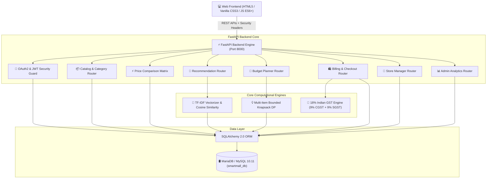

# SmartMall / ShopWise AI 🛍️🤖

> **Intelligent Product Discovery, Multi-Store Price Comparison, Explainable AI Recommendations, Smart Shopping Planner & 18% GST Invoicing Platform**


-success?style=flat-square)


---

## 📌 Executive Summary & Problem Statement

Modern e-commerce retail is highly fragmented. Consumers struggle to compare real-time prices across competing stores, identify optimal multi-product bundles matching strict budgets, understand why products are recommended, and receive transparent GST tax invoices upon purchasing.

**SmartMall / ShopWise AI** resolves these challenges by combining:
1. **Multi-Store Price Comparison**: Live side-by-side matrix across 5 competing retail vendors.
2. **Explainable AI Recommendations**: TF-IDF text vectorization & Cosine Similarity in vector space with human-readable rationale explanations.
3. **Smart Shopping Planner**: Multi-item bounded knapsack dynamic programming budget optimization.
4. **End-to-End Billing & GST Invoicing**: Active shopping cart, stock deduction, Indian 18% GST calculation (9% CGST + 9% SGST), sequential order/invoice generation (`#ORD-2026-XXXX`, `#INV-2026-XXXX`), and printable tax invoices.
5. **Multi-Tenant Store Management & System Analytics**: Store Manager order fulfillment with strict cross-store isolation (`403 Forbidden`) and Admin sales analytics with automated CSV report exports.

---

## 📊 Verified System Metrics Summary

| Metric / Scope | Quantity | Status |
| :--- | :---: | :--- |
| **Product Categories** | **37** | Verified Across Electronics, Fashion, Home, Appliances, Fitness & Grooming |
| **Master Catalog Products** | **232** | Verified with Brand, Image, Base Price & Technical Specifications |
| **Competing Retail Stores** | **5** | TechLand, MegaMart, SmartElectronics, StyleHub, HomeDecor |
| **Store Price Listings** | **580** | Live side-by-side retail price comparison listings |
| **Price History Audit Logs** | **31** | Tracked historic price changes and drop trends |
| **Billing & Order DB Tables** | **5** | `carts`, `cart_items`, `orders`, `order_items`, `invoices` |
| **Master Diagnostic Tests** | **90 / 90 (100%)** | PASS across all 9 core platform subsystems |

---

## 🌟 Key Features

- 🔍 **Multi-Store Product Discovery**: Filter across 37 categories and 232 products with real-time stock indicators.
- ⚡ **Side-by-Side Price Comparison Matrix**: View live pricing across competing stores with automatic **🔥 Best Price** highlighting.
- 📈 **Price Drop & Historical Audit Trail**: Automatic logging of price updates into audit history tables.
- 🤖 **Explainable AI Recommendations**: Calculates Cosine Similarity scores over TF-IDF product vectors and displays plain-text explanations for every recommendation.
- 💡 **Smart Shopping Planner**: Enter budget prompts (e.g. *"Gaming setup under ₹70,000"* or *"Traditional Indian outfit under ₹8,000"*) to generate optimal multi-item bundles.
- 🛒 **1-Click Cart Transfer**: Transfer Smart Planner recommended bundles directly into your active shopping cart.
- 🛍️ **Checkout & 18% Indian GST Calculation**: Automatic tax calculation ($18\% \text{ GST} = 9\% \text{ CGST} + 9\% \text{ SGST}$) and simulated payment checkout.
- 🖨️ **Printable GST Tax Invoices**: Generates official GST Tax Invoices (`#INV-2026-XXXX`) with PDF print/download capabilities.
- 📦 **Store Manager Order Fulfillment**: Store Managers track order items belonging exclusively to their store and update fulfillment status (`CONFIRMED`, `SHIPPED`, `DELIVERED`, `CANCELLED`).
- 💰 **Admin System Analytics & CSV Exports**: Mall-wide sales metrics, Interactive Chart.js charts, and automated CSV report exports for store performance, activity logs, and sales.

---

## 🛠️ Complete Technology Stack

```
 🎨 FRONTEND SYSTEM          ⚡ BACKEND ENGINE             🤖 AI & DATA SCIENCE
 ├─ HTML5 & Vanilla CSS3     ├─ Python 3.10+              ├─ Scikit-Learn (TF-IDF)
 ├─ Modern Glassmorphism     ├─ FastAPI Framework         ├─ Cosine Similarity Matrix
 ├─ JavaScript (ES6+ Async)  ├─ Uvicorn / Gunicorn Server ├─ Bounded Knapsack Engine
 └─ Chart.js Visualizations  └─ Pydantic v2 Validation   └─ NumPy Data Processing
 
 🛢️ DATABASE & ORM           🔐 SECURITY & RBAC           📄 EXPORT & AUDIT
 ├─ MariaDB / MySQL 10.11    ├─ JWT Bearer Token Auth     ├─ Python CSV Generator
 ├─ SQLAlchemy 2.0 ORM       ├─ Passlib (Bcrypt Hashing)  ├─ Formula Injection Shield
 └─ PyMySQL Database Driver  └─ Security Headers (DENY)   └─ Printable HTML Invoices
```

---

## 🏗️ Complete System Architecture



---

## 🧠 Explainable AI & Budget Optimizer Architecture

### 1. Explainable AI Recommendation Engine
1. **Vector Construction**: Concatenates product attributes (`name`, `brand`, `category`, `specifications`, `description`) into text documents.
2. **TF-IDF Vectorization**: Fits a `TfidfVectorizer` to construct a high-dimensional TF-IDF feature space.
3. **Similarity Matrix**: Computes pair-wise Cosine Similarity score:
   $$\text{Similarity}(A, B) = \frac{\vec{A} \cdot \vec{B}}{\|\vec{A}\| \|\vec{B}\|}$$
4. **Rationale Explainer**: Analyzes overlapping category, brand, and feature keywords to construct human-readable explanations (e.g., *"Recommended (85% match) because both products belong to Electronics and share matching 16GB RAM specs"*).

### 2. Smart Shopping Planner (Bounded Knapsack Optimizer)
1. **Intent Parsing**: Extracts target keywords and maximum budget constraint $B$ from customer natural language prompts.
2. **Relevance Scoring**: Ranks catalog products based on TF-IDF cosine similarity against target query.
3. **Dynamic Programming Optimization**: Solves the Bounded Knapsack Problem:
   $$\max \sum_{i=1}^n v_i x_i \quad \text{subject to} \quad \sum_{i=1}^n c_i x_i \le B, \quad x_i \in \{0, 1\}$$
4. **1-Click Cart Transfer**: Converts optimized bundle items directly into active cart items via `POST /api/v1/cart/transfer-planner-bundle`.

---

## 🗺️ Complete Customer Journey

```
[1. Discover Product] ──► [2. Compare Store Prices] ──► [3. AI Recommendation]
          │                                                      │
          ▼                                                      ▼
[4. Smart Shopping Planner] ──► [5. Transfer Bundle] ──► [6. Shopping Cart]
                                                                 │
                                                                 ▼
[9. Print Tax Invoice] ◄── [8. Order History] ◄── [7. Simulated Checkout]
```

1. **Discovery**: Customer searches catalog or selects from 37 categories.
2. **Price Comparison**: Customer clicks **⚡ Compare Prices** to view side-by-side store prices.
3. **AI Recommendations**: Customer views **🤖 Similar Products** with match percentages and explicit AI reasoning.
4. **Smart Planning**: Customer inputs prompt (e.g. *"Men formal office wear under ₹8,000"*) to generate an optimized multi-item bundle.
5. **Cart Transfer**: Customer clicks **🛒 Transfer Smart Bundle to Cart** to load all recommended items into their cart.
6. **Cart Review**: Customer adjusts quantities, views subtotal, and inspects estimated 18% GST tax breakdown.
7. **Checkout**: Customer enters delivery address, selects payment method (simulated credit card / UPI), and confirms order.
8. **Fulfillment & Order History**: Customer tracks order status while the assigned Store Manager fulfills line items.
9. **Invoice**: Customer clicks **🖨️ Tax Invoice** to view and print their official GST Tax Invoice.

---

## 👥 Store Manager & Admin Workflows

### Store Manager Workflow
- **Store Dashboard**: Restricted strictly to manager's assigned store ID.
- **Inventory Control**: Update regular/discount prices and toggle stock status (`In_Stock`, `Low_Stock`, `Out_of_Stock`), writing to `price_history`.
- **Order Item Fulfillment**: View order line items for their store and update fulfillment status (`CONFIRMED` $\rightarrow$ `SHIPPED` $\rightarrow$ `DELIVERED`).
- **Data Export**: Download inventory and price history CSV reports for their store.

### Admin Workflow
- **System Overview**: Monitor mall-wide metrics: 232 products, 37 categories, 5 stores, 580 price listings, 31 audit logs, and total mall sales revenue.
- **Analytics**: Audit category product concentration, stock breakdown, search frequency, and store performance.
- **Data Export**: Download CSV reports for Store Performance, Activity Logs, and Sales Orders.

---

## 🛢️ Database Architecture & Entity Relationships

The platform utilizes **MariaDB 10.11 / MySQL 8** (`smartmall_db`) containing 13 normalized tables:

```
  +---------------+       +------------------+       +---------------+
  |     users     |<----->|      stores      |<----->| store_prices  |
  +---------------+       +------------------+       +---------------+
          |                        |                         |
          v                        v                         v
  +---------------+       +------------------+       +---------------+
  |     carts     |       |    cart_items    |       |   products    |
  +---------------+       +------------------+       +---------------+
          |                                                  |
          v                                                  v
  +---------------+       +------------------+       +---------------+
  |    orders     |<----->|   order_items    |       |  categories   |
  +---------------+       +------------------+       +---------------+
          |
          v
  +---------------+
  |   invoices    |
  +---------------+
```

- `users`: User profiles, hashed passwords, and RBAC roles (`Customer`, `Store_Manager`, `Admin`).
- `stores`: Retail store profiles and manager assignments.
- `categories`: 37 multi-level categories.
- `products`: 232 master product catalog items.
- `store_prices`: 580 store price listings, discount prices, and stock statuses.
- `price_history`: Historic audit log tracking price updates.
- `reviews`: Customer product ratings and reviews.
- `user_interactions`: Audit log tracking search, view, compare, and login events.
- `carts` & `cart_items`: Active shopping cart line items.
- `orders` & `order_items`: Master order headers and store-isolated line items.
- `invoices`: Official GST Tax Invoice records ($18\% \text{ GST} = 9\% \text{ CGST} + 9\% \text{ SGST}$).

---

## 🔌 API Documentation Overview

The FastAPI backend exposes RESTful endpoints under `/api/v1`:

| Router Group | Method | Endpoint | Description |
| :--- | :---: | :--- | :--- |
| **Authentication** | `POST` | `/api/v1/auth/login` | Authenticate user and issue JWT access token |
| | `POST` | `/api/v1/auth/register` | Register new Customer account |
| **Products & Catalog** | `GET` | `/api/v1/products` | Paginated product search with category filters |
| | `GET` | `/api/v1/products/{id}` | Detailed product information |
| **Price Comparison** | `GET` | `/api/v1/compare/matrix` | Side-by-side store price comparison matrix |
| **AI Recommendations** | `GET` | `/api/v1/recommendations/similar/{id}` | TF-IDF Cosine Similarity recommendations with rationale |
| **Smart Planner** | `POST` | `/api/v1/planner/bundle` | Multi-item bounded knapsack budget optimizer |
| **Shopping Cart** | `GET` | `/api/v1/cart` | Get active shopping cart summary and 18% GST estimate |
| | `POST` | `/api/v1/cart/items` | Add product listing to active cart |
| | `PUT` | `/api/v1/cart/items/{id}` | Update cart item quantity |
| | `DELETE` | `/api/v1/cart/items/{id}` | Remove item from cart |
| | `POST` | `/api/v1/cart/transfer-planner-bundle` | Transfer Smart Planner bundle directly to cart |
| **Checkout & Invoices** | `POST` | `/api/v1/checkout/process` | Process checkout, deduct stock, generate Order & Invoice |
| | `GET` | `/api/v1/orders/my-orders` | Customer order history |
| | `GET` | `/api/v1/invoices/{id}/render` | Render printable HTML GST Tax Invoice |
| **Store Manager** | `GET` | `/api/v1/store-manager/my-store` | Store profile and inventory statistics |
| | `GET` | `/api/v1/store-manager/orders` | Store-isolated customer order items |
| | `PUT` | `/api/v1/store-manager/order-items/{id}/status` | Update store item fulfillment status |
| | `GET` | `/api/v1/store-manager/reports/export-inventory` | Export inventory CSV report |
| **Admin System** | `GET` | `/api/v1/admin/metrics/overview` | Mall-wide system metrics overview |
| | `GET` | `/api/v1/admin/orders` | Mall-wide sales metrics and recent orders |
| | `GET` | `/api/v1/admin/reports/export-orders-csv` | Export mall sales & orders CSV report |
| **Health Status** | `GET` | `/api/v1/health/system-status` | System health status and operational metrics |

Interactive API Documentation is available at `http://localhost:8000/docs` (Swagger UI) and `http://localhost:8000/redoc` (ReDoc).

---

## 🔒 Security & RBAC Enforcement

1. **JWT Bearer Token Security**: All protected routes require a valid HTTP Bearer JWT token signed with HMAC-SHA256.
2. **Role-Based Access Control (RBAC)**: Endpoint authorization enforced via FastAPI `RoleChecker([UserRole.Admin])` and `RoleChecker([UserRole.Store_Manager])` dependency injection.
3. **Cross-Store Data Isolation**: Service functions enforce `item.store_id == manager.store_id`, returning `HTTP 403 Forbidden` if a Store Manager attempts to modify another store's item.
4. **HTTP Security Headers Middleware**: Injects `X-Frame-Options: DENY`, `X-Content-Type-Options: nosniff`, `X-XSS-Protection: 1; mode=block`, and `Referrer-Policy: strict-origin-when-cross-origin`.
5. **CSV Formula Injection Shield**: All exported CSV cell values are sanitized (`_sanitize_csv_val`) to neutralize formula injection (`=`, `+`, `-`, `@`).

---

## 🧪 Master Verification Test Suite (90 / 90 PASS)

The master verification test suite (`backend/verify_phase6_master.py`) executes diagnostic tests across all 9 platform sections:

```text
================================================================================
MASTER VIVA TEST SUITE SUMMARY MATRIX:
================================================================================
  * Section 1: Core Diagnostics             :  9 /  9 PASS (100%)
  * Section 2: Smart Shopping Planner       :  8 /  8 PASS (100%)
  * Section 3: Store Manager & Admin RBAC   : 15 / 15 PASS (100%)
  * Section 4: Women's Fashion Catalog      :  9 /  9 PASS (100%)
  * Section 5: Men's Fashion Catalog        :  9 /  9 PASS (100%)
  * Section 6: Analytics Visualizations     : 11 / 11 PASS (100%)
  * Section 7: Report Exports & Savings Digest:  8 /  8 PASS (100%)
  * Section 8: Phase 6 Master Integration   : 11 / 11 PASS (100%)
  * Section 9: Billing & Checkout Subsystem : 10 / 10 PASS (100%)
--------------------------------------------------------------------------------
  TOTAL MASTER SUITE VERIFICATION STATUS   : 90 / 90 PASS (100.0%)
================================================================================
```

---

## 📸 Feature Screenshot Showcase

| Feature / UI Module | Preview Screenshot |
| :--- | :--- |
| **Customer Storefront Hero & Search** |  |
| **Multi-Category Product Catalog** |  |
| **Side-by-Side Multi-Store Price Comparison Matrix** |  |
| **Explainable AI Recommendations Insights** |  |
| **Smart Shopping Planner & Budget Optimizer** |  |
| **Active Shopping Cart & 18% GST Checkout** |  |
| **Printable GST Tax Invoice** |  |
| **Store Manager Inventory & Order Fulfillment** |  |
| **Admin System Analytics & Revenue Dashboard** |  |

---

## ⚙️ Installation & Local Setup Instructions

### Prerequisites
- Python 3.10 or higher
- MariaDB 10.11 or MySQL 8.0 server

### 1. Database Setup
Ensure MariaDB/MySQL is running on `127.0.0.1:3306` with user `root` (no password or as configured in `.env`). Create the database:
```sql
CREATE DATABASE smartmall_db CHARACTER SET utf8mb4 COLLATE utf8mb4_unicode_ci;
```

### 2. Environment Configuration
Copy `.env.example` to `.env` in the project root:
```ini
DATABASE_URL=mysql+pymysql://root:@127.0.0.1:3306/smartmall_db
SECRET_KEY=smartmall-super-secret-capstone-jwt-key-2026
ALGORITHM=HS256
ACCESS_TOKEN_EXPIRE_MINUTES=1440
BACKEND_CORS_ORIGINS=["http://localhost:8000","http://127.0.0.1:8000","http://localhost:3000"]
```

### 3. Virtual Environment & Dependencies Setup
```bash
# Create and activate virtual environment
python -m venv venv
venv\Scripts\activate      # Windows
# source venv/bin/activate # Linux / macOS

# Install required dependencies
pip install -r backend/requirements.txt
```

### 4. Database Initialization & Catalog Expansion
```bash
# Initialize schema tables and seed baseline data
$env:PYTHONPATH=".;backend"; python backend/setup_mysql.py

# Expand multi-category catalog to 37 categories and 232 products
$env:PYTHONPATH=".;backend"; python backend/expand_catalog.py
```

### 5. Running the Backend Server
```bash
$env:PYTHONPATH=".;backend"; python -m uvicorn app.main:app --host 0.0.0.0 --port 8000 --reload
```

### 6. Accessing the Web Frontends
- **Customer Storefront**: Open `http://localhost:8000` or `frontend/index.html` in your browser.
- **Store Manager Portal**: Open `frontend/store-dashboard.html` in your browser.
- **Admin Dashboard**: Open `frontend/admin-dashboard.html` in your browser.
- **Interactive API Documentation**: Open `http://localhost:8000/docs` in your browser.

### 7. Run Verification Test Suite
```bash
$env:PYTHONPATH=".;backend"; python backend/verify_phase6_master.py
```

---

## 📁 Repository Structure Tree

```text
smartmall-management-system/
├── .env.example
├── README.md
├── ai_module/
│   ├── __init__.py
│   ├── budget_optimizer.py       # Bounded knapsack budget optimization core
│   ├── bundle_engine.py          # Bundle generation helper functions
│   ├── explainer.py              # Plain-text recommendation rationale generator
│   ├── planner_models.py        # Pydantic data schemas for AI planner
│   ├── preprocessing.py          # Text tokenization & cleaning
│   ├── recommendation_engine.py  # TF-IDF Vectorizer & Cosine Similarity engine
│   └── similarity_engine.py      # Low-level matrix similarity scoring
├── backend/
│   ├── requirements.txt          # Python project dependencies
│   ├── run_production.py         # Production server launcher script
│   ├── setup_mysql.py            # Database schema setup & seed script
│   ├── expand_catalog.py         # Catalog expansion script (37 categories, 232 products)
│   ├── verify_all.py             # Phase 3 core diagnostic verification suite
│   ├── verify_planner.py         # Phase 3B Smart Shopping Planner test suite
│   ├── verify_phase4.py          # Phase 4 Store Manager & Admin RBAC test suite
│   ├── verify_womens_fashion.py  # Phase 5 Step 1B Women's fashion test suite
│   ├── verify_mens_fashion.py    # Phase 5 Step 1C Men's fashion test suite
│   ├── verify_phase5_analytics.py# Phase 5 Step 2 Analytics test suite
│   ├── verify_phase5_step3.py    # Phase 5 Step 3 Reports & CSV test suite
│   ├── verify_billing_checkout.py# Phase 7 Billing, Cart & GST test suite
│   ├── verify_phase6_master.py   # Unified 90-test master viva verification suite
│   └── app/
│       ├── main.py               # FastAPI application entry point & middleware
│       ├── api/
│       │   ├── deps.py           # Dependency injection & authentication guards
│       │   ├── dependencies.py   # RoleChecker RBAC dependency class
│       │   └── routers/
│       │       ├── admin.py         # Admin analytics & CSV export router
│       │       ├── auth.py          # User authentication router
│       │       ├── checkout.py      # Cart, checkout & invoice router
│       │       ├── compare.py       # Price comparison matrix router
│       │       ├── planner.py       # Smart shopping planner router
│       │       ├── products.py      # Catalog & category search router
│       │       ├── recommendations.py# AI recommendation router
│       │       └── store_manager.py # Store manager portal router
│       ├── core/
│       │   ├── config.py         # Application configuration & Pydantic settings
│       │   └── security.py       # Password hashing & JWT token handling
│       ├── db/
│       │   └── session.py        # SQLAlchemy engine & session factory
│       ├── models/
│       │   ├── __init__.py
│       │   ├── analytics.py      # Interaction audit model
│       │   ├── billing.py        # Cart, CartItem, Order, OrderItem, Invoice models
│       │   ├── category.py       # Category model
│       │   ├── price.py          # StorePrice model
│       │   ├── price_history.py  # PriceHistory audit model
│       │   ├── product.py        # Product model
│       │   ├── review.py         # Review model
│       │   ├── store.py          # Store model
│       │   └── user.py           # User & UserRole models
│       ├── schemas/
│       │   ├── billing.py        # Cart & checkout Pydantic schemas
│       │   └── product.py        # Product & category Pydantic schemas
│       └── services/
│           ├── admin_service.py         # Admin business logic & CSV export
│           ├── checkout_service.py      # Billing, checkout & GST tax invoice logic
│           ├── product_service.py       # Product search & comparison logic
│           └── store_manager_service.py # Store manager business logic
├── docs/
│   ├── viva_demo_guide.md        # Evaluator presentation guide & Q&A script
│   └── screenshots/              # Captured UI feature screenshots (01 to 09)
└── frontend/
    ├── index.html                # Customer storefront HTML
    ├── app.js                    # Customer storefront JavaScript logic
    ├── store-dashboard.html      # Store Manager portal HTML
    ├── js/
    │   ├── admin.js              # Admin dashboard JavaScript logic
    │   └── store_manager.js      # Store Manager portal JavaScript logic
    ├── admin-dashboard.html      # Admin analytics dashboard HTML
    └── styles.css                # Global glassmorphism design system CSS
```

---

## 🔮 Future Scope & Roadmap

- 🔔 **Real-Time WebSockets Notifications**: Live price drop alerts and instant order fulfillment updates.
- 💳 **Online Payment Gateway Integration**: Real-world payment gateway integrations (Razorpay, Paytm, Stripe).
- 📱 **Mobile Native Application**: React Native / Flutter cross-platform mobile shopping application.
- 🌐 **Multi-Language & Localization**: Multi-lingual interface supporting regional Indian languages.

---

## 🏆 Project Status

**Portfolio Version 1.0 — Completed & Verified**  
- **Automated Diagnostic Suite**: **90 / 90 PASS (100%)**
- **Subsystem Errors**: 0
- **Subsystem Warnings**: 0
- **Database Architecture**: Verified & Operational

---

## ✍️ Credits & Author

**SmartMall / ShopWise AI Project Engineering Team**  
*Major Diploma Project in Information Technology (IT)*  
Built with Python, FastAPI, Scikit-learn, SQLAlchemy, MariaDB/MySQL, and Vanilla CSS3.
